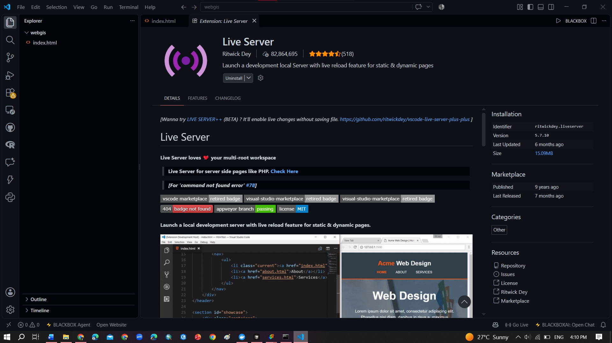
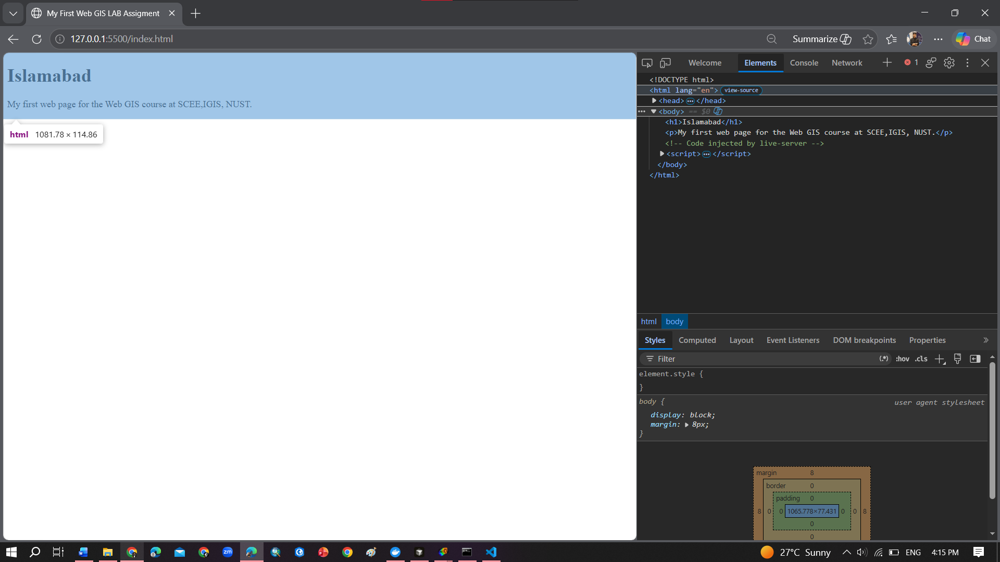
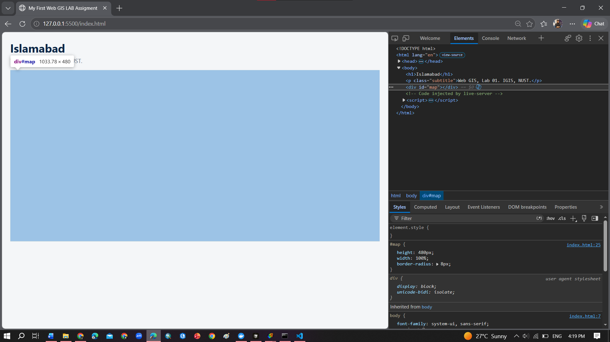
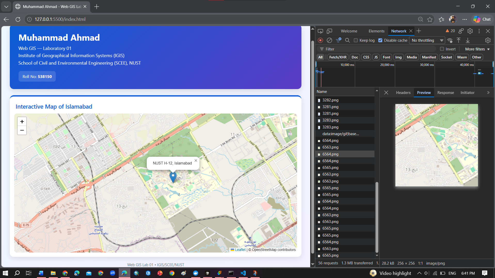
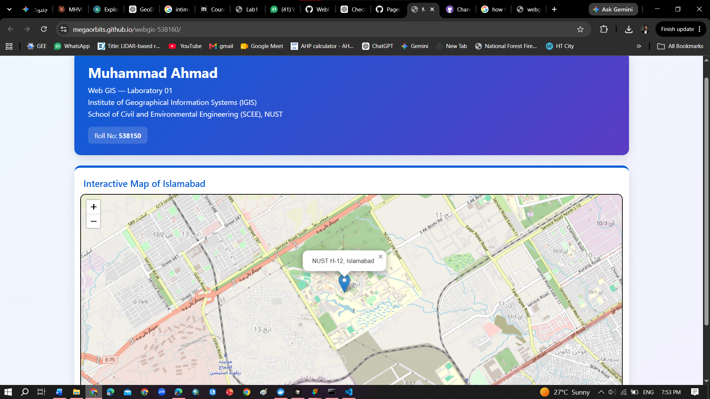

# Web GIS Laboratory 01: My First Web Map

**Student Name:** Muhammad Ahmad  
**Roll No.:** 538160  
**Program:** MS Remote Sensing & GIS  
**Department:** Institute of Geographical Information Systems (IGIS)  
**School:** School of Civil and Environmental Engineering (SCEE), NUST

---

## Checkpoint 1 — Project Setup

VS Code with the `C:\webgis` project folder and Live Server extension installed.

---

## Checkpoint 2 — First Web Page

The first web page running through Live Server at `127.0.0.1`, with Developer Tools open on the Elements tab.

---

## Checkpoint 3 — CSS and Map Container

The styled page with the `#map` container selected in Developer Tools and its CSS rules visible.

---

## Checkpoint 4 — Leaflet Network Requests

The working Islamabad map with Developer Tools open on the Network tab, showing a PNG tile request and its Preview.

---

## Checkpoint 5 — Published Web Map

The final web map published through GitHub Pages.

---

# Questions

## 1. Why did the page make one network request at first and dozens after adding the map?

Initially, the page only needed to load the `index.html` file, so there was one main request. After adding Leaflet and the OpenStreetMap tile layer, the browser had to download the Leaflet library and many individual map tiles, which resulted in dozens of network requests.

## 2. What is the difference between HTML and CSS?

HTML defines the structure and content of a web page, while CSS controls its appearance and layout. For example, the `<h1>` element in my file creates the main heading, while the CSS `h1` rule controls its styling.

## 3. Why does the `#map` rule need a height, while the `h1` rule does not?

The map is placed inside a `
`, which has no useful height by default when it is empty. The `#map` rule therefore needs a height so Leaflet has a visible area in which to draw the map. The `<h1>` element already has a natural height based on its content.

## 4. Why does opening the page through Live Server at `127.0.0.1` matter?

Live Server runs the page through a real local web server instead of opening it directly from the file system. This is important because browsers can restrict requests made by pages opened using a `file:///` address, while the local server behaves more like a real web server.

## 5. Why might a marker appear near Africa instead of Islamabad?

The latitude and longitude may have been entered in the wrong order. Leaflet expects coordinates as `[latitude, longitude]`, so the values should be checked and corrected to the proper order.

---

## Final URLs

**GitHub Repositoryvfor the lab1:**  
[(https://github.com/megaorbits/webgis-538160/tree/main)]

**GitHub Pages:**
[(https://megaorbits.github.io/webgis-538160/)]